## Data Collection Protocol Setup

### Pre-requisites

- **[Python](https://www.python.org/)**: To run the scripts, you need Python installed on your system.
  - Ensure your terminal is open in the directory where this repository is cloned to run the Python commands. 
- **GitHub Repository:** Clone/download the repository as it contains all the necessary files. After cloning the repository, run: `pip install -r requirements.txt` to install the required Python packages.
- **[PsychoPy](https://www.psychopy.org/download.html)**
- **[Lab Recorder](https://github.com/labstreaminglayer/App-LabRecorder/releases):** Choose the executable for your operating system. Check [this page](https://github.com/labstreaminglayer/App-LabRecorder?tab=readme-ov-file#dependencies) for specific instructions for your operating system.
- **Scripts:** 
  - LSL Computer Audio Recorder (record_audio.py)
  - Testing Audio Input (test_audio_input.py)
  - Check Recorded Data (check_data.py)

### Lab Recorder Configuration

- Currently, there are some issues with setting up the lab recorder for Apple Silicon Macs. Follow [this guide]((https://github.com/labstreaminglayer/App-LabRecorder/issues/109)) to resolve it or use the Windows or Linux operating system.
- Ensure `RCS` is enabled and `RCS port` is set to `22345` 
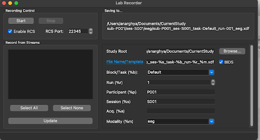
- Select an appropriate location for the study root
- Leave the rest of the fields unchanged

### Testing Audio Input Script

- Run the script: `python3 test_audio_input`
- All audio recording devices connected to the computer will be displayed once you run the script. Input the number corresponding to the recording device you wish to test, and it will record 3 seconds of audio and play it back.
- If you can't hear the audio that you recorded played back, rerun the script and try a different input device.

### Audio Recording Script

- Run the script: `python3 record_audio.py`
- Once you run the script, all audio recording devices connected to the computer will be displayed. 
  - Run the testing audio input script before to make sure the selected audio recording input works 
- Input the number corresponding to the recording device you wish to use for recording audio for this experiment, and press enter.
- This will start streaming audio from your computer to LSL to record audio data. **Make sure the script continues to run in the background throughout your recording.**
- To stop the script, press `Ctrl+C` once the experiment is finished.

### EEG Recording Configuration

#### OpenBCI

- Open the OpenBCI GUI and configure it according to your hardware specifications.
- Select the data source and transfer protocol, and ensure that 16 channels are selected if available.
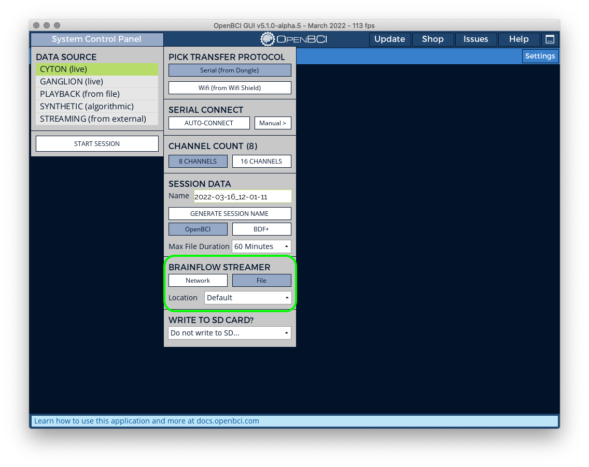
- Select the file under the brain flow streamer section and set Location to `Default`. The OpenBCI data file is stored in the documents section; share this file if requested.
- Click on `Start Session`
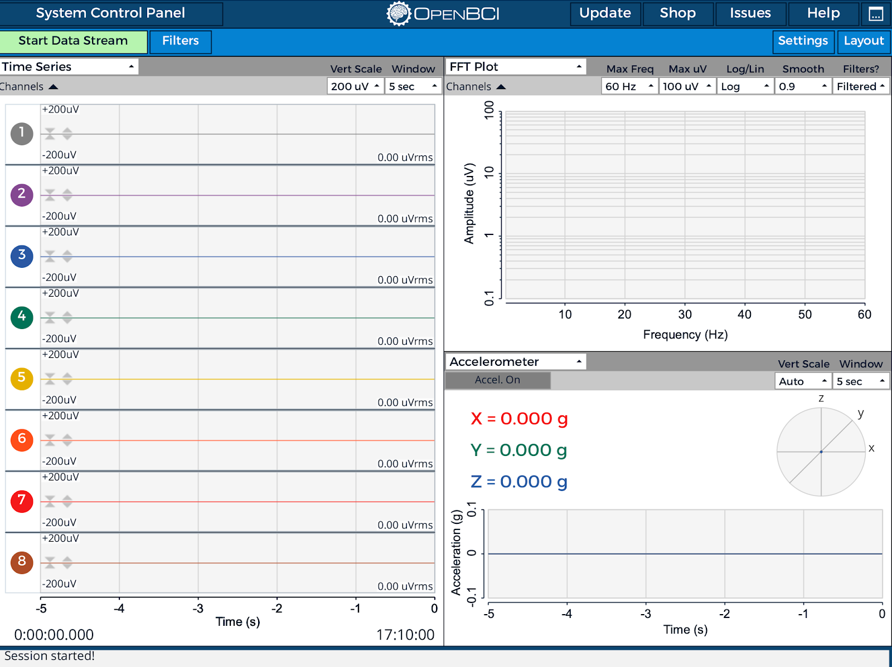
- For good signal quality, ensure that the impedance levels are below 20kΩ. For more information, check the headplot view in the OpenBCI GUI.
- Click on `Start Data Stream`, and you should see data streaming in the GUI
- In the bottom right panel, in the dropdown where Accelerometer is selected in the screenshot above, select `Networking`
- Change the Protocol from `UDP` to `LSL`, update the Data Type for `Stream 1` to `TimeSeriesRaw`
- Click on `Start LSL Stream`
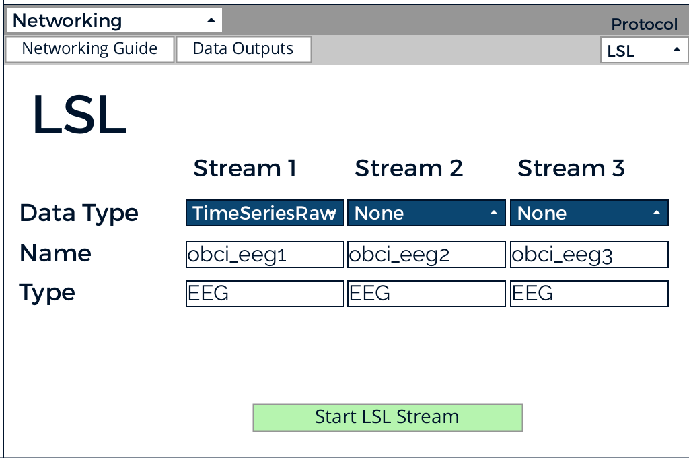

#### fNIRS

- Check [this page](https://labstreaminglayer.readthedocs.io/info/supported_devices.html#supported-fnirs-hardware) for a list of LSL-supported fNIRS devices
- Find similar settings in your fNIRS device software as the OpenBCI above to enable LSL stream and make sure it is visible in the Lab Recorder 

### PsychoPy Configuration

- PsychoPy is the primary application used to run the experiment 
- Run PsychoPy and open the experiment file (ending with `.psyexp`) from the cloned Github repository.
- You should see the following screen if everything is loaded correctly: 

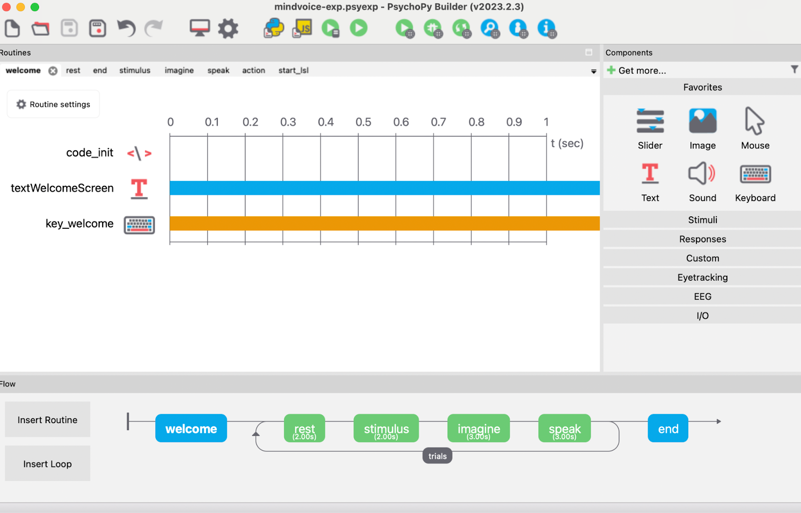
*Experiment Part 1*

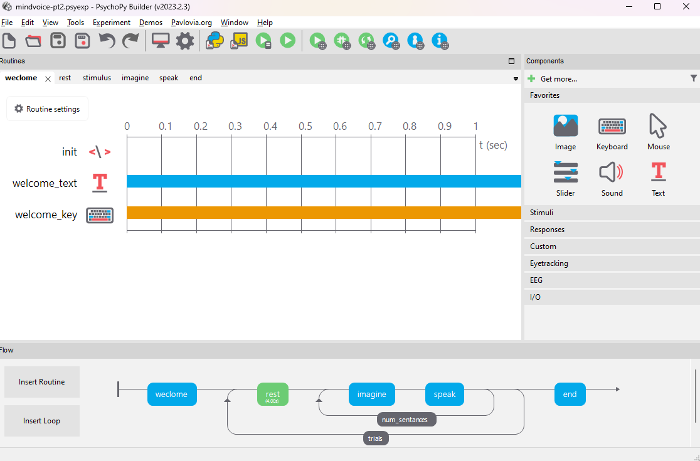
*Experiment Part 2*

- If you are using multiple monitors, you can select the display where you want the experiment to run by clicking the settings button (gear icon in the screenshot below), choosing the screen tab, and entering the screen number in the text box. You can click on the “show screen numbers” button to identify the screen numbers for each screen. All the buttons and inputs required to perform this are highlighted in red in the screenshot below.
  
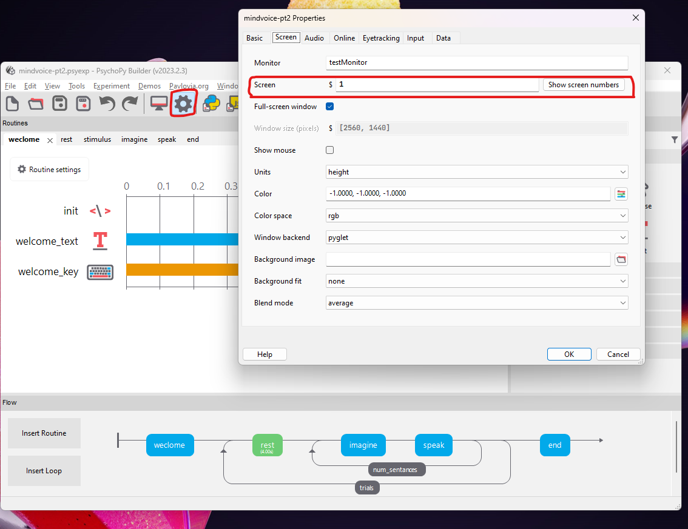

- To test the setup, you can set the value of `test_run` input to `true` when you run the experiment (it is case-sensitive; make sure it's all lowercase).
  - This will execute the stimuli loop once, enabling you to promptly verify the correct display of stimuli on the screen and ensure that the lab recorder stops and saves the data accurately after the experiment completes
  - Applicable to both parts of the experiment 
  
  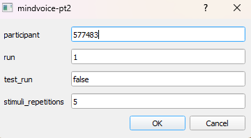

### Running the Experiment

- Ensure all applicable components (EEG recording device, Audio Recording Scripts, and PsychoPy) are correctly configured and running.
  - Make sure the EEG recording device, audio recorder script, and Lab Recorder application are running before starting the experiment from Psychopy
  - For part 1, open the `mindvoice-pt1.psyexp` file, and for part 2, open the `mindvoice-pt2.psyexp` file in PsychoPy 
- Open Psychopy and run the experiment using the play (annotated in red square)
  
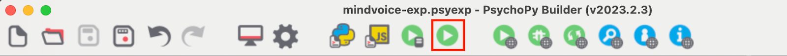

- A new dialog will open where you can enter a unique ID (number) for the participant and leave the run unchanged unless you record multiple runs.
  - `test_run`: as described in the previous section, is for testing; set it to `true` (case sensitive) to test your setup
  - `stimuli_repetitions`: The number of times each stimulus repeats (words for part 1 and paragraphs for part 2). By default, this value is set to 5; unless specified, you don’t need to change it. 
  
  

- After clicking OK, the experiment will start. Please make sure the subjects follow the prompts on the screen.
  - Note: You can press the Escape key to stop the experiment in case of an error, but the data will not be recorded, and the recording will not be stopped in the Lab Recorder. Please ensure you manually stop the Lab Recorder and restart the experiment.

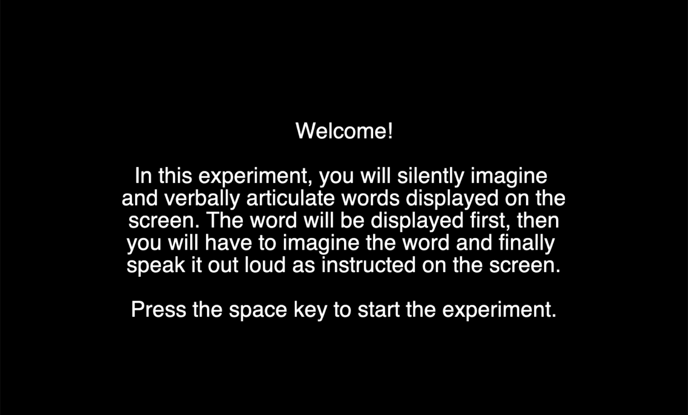

- Also, please ensure the Lab Recorder records all data streams once the experiment starts in PsychoPy. Using two screens during the experiment will be beneficial, one where the experiment is run and the other where you can see the lab recorder running.

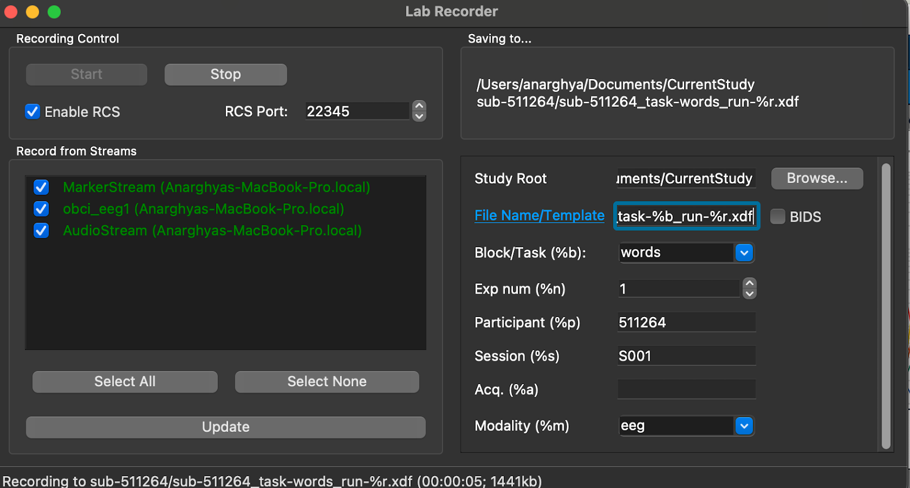

- The recording will end automatically when the experiment finishes. The stop should be greyed out (in the previous image); if not, manually click stop. 

- Once the experiment finishes, the data file with markers, audio, and EEG data should be stored in the `Study Root` folder path found in the Lab Recorder. A single `.xdf` file will be created for each part of the experiment per subject.
- Once part 1 of the experiment is done, open the part 2 experiment file in PsychoPy and repeat the steps.
  
### Check Recorded Data

- To check if the data in the file created by the Lab Recorder was correctly stored, you can run the following command `python3 check_data.py <path_to_data_file>`
  - `<path_to_data_file>` argument expects the path where the `.xdf` you want to check is stored. 
- This script checks if there are three streams of data (EEG/fNIRS, Audio, Markers) recorded in `.xdf` file. It creates a folder called `temp_data` with an `audio.wav` file containing the complete audio recording of the experiment and a `markers.txt` file containing the names of all the stimuli recorded in that data file. 
